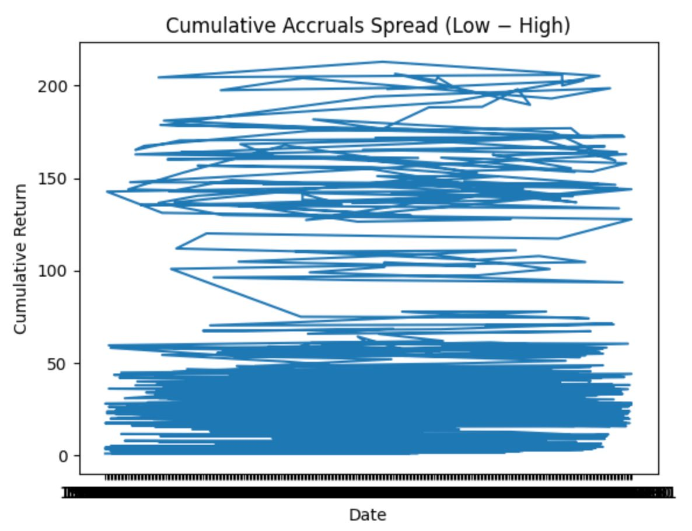
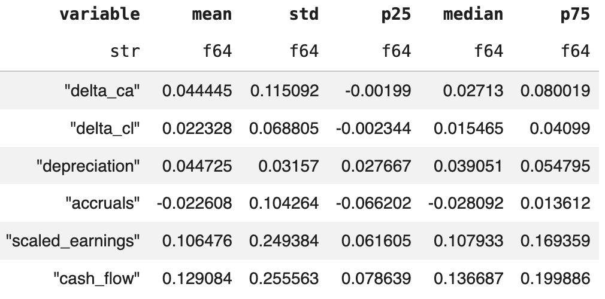
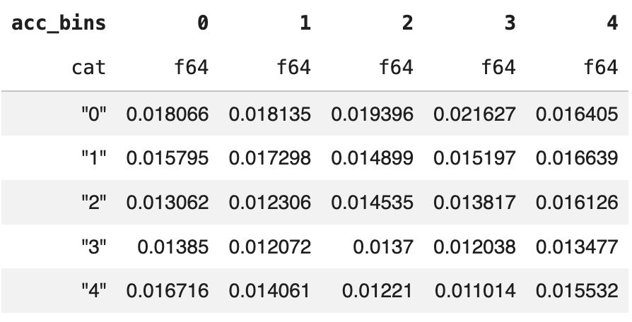

# Research Report

**Project Title:**  Accruals Signal

**Author(s):**  Sam Lundberg, Alyssa Hall, Maxwell Schmutz

**Date:**  3/5/26

**Version:**  1

---

## 1. Summary

The goal of this project is to examine whether accrual-based measures of earnings quality can predict future stock returns. Prior research provides strong evidence that firms with high accruals tend to earn lower subsequent returns. Our objective is to replicate these results using CRSP and Compustat data, evaluate the robustness of the findings, and determine whether an accruals-based signal has value for portfolio construction. Unfortunately, as has been attested by several other papers, accruals signal is mostly dead and doesn’t result in predictive power. Possible that it lives on in specific, niche markets, but that would require more research.

### Key Metrics

| Metric | Value | Notes |
|------|------|------|
| Primary Metric | Accruals | Calculated as change in current assets minus change in current liabilities minus depreciation |

## 2. Data Requirements

**Sources**
-  Merged Compustat/CRSP dataset

**Rate of Availability**
-  Available monthly through Wharton Research Data Services (WRDS)

**Inputs Required**
-  

**Preprocessing**
-  Paper replication between 1970-01-01 and 1994-12-31
-  Only keep industrial firms
-  When calculating accounting variables, make sure to get rid of values where average total assets is equal to 0 so as to avoid infinite values.
 
---

## 3. Approach / System Design

**Economic Intuition**

Accruals measure the difference between reported earnings and cash flows, capturing the portion of earnings that arises from accounting adjustments rather than actual cash received or paid. In practice, accruals reflect changes in working capital items such as receivables, payables, and inventories. When a firm reports high accruals, it means that a large share of its earnings is not supported by current cash flows but instead comes from accounting entries. The economic intuition behind the accrual signal is that earnings driven heavily by accruals are often less sustainable than cash-based earnings. As a result, firms with high accruals may appear more profitable in the short term but are more likely to experience declines in future performance as those accounting adjustments reverse. Conversely, firms with low accruals tend to have earnings that are more strongly supported by cash flows, making their profitability more persistent. This leads to the empirical pattern documented in the literature: high-accrual firms tend to earn lower subsequent stock returns, while low-accrual firms tend to outperform.

**Accruals Signal**

$$
\text{Accruals} = \Delta \text{Current Assets} - \Delta \text{Current Liabilities} - \text{Depreciation}
$$

Expanded in terms of working capital accounts:

$$
\text{Accruals} = (\Delta \text{Accounts Receivable} + \Delta \text{Inventory} + \Delta \text{Other Current Assets}) - (\Delta \text{Accounts Payable} + \Delta \text{Other Current Liabilities}) - \text{Depreciation}
$$

---

## 4. Code Structure

```
sf-signal/
├── src/
│   ├── framework/
│   │   ├── ew_dash.py            # Equal-weight dashboard (do not edit)
│   │   ├── opt_dash.py           # Optimal portfolio dashboard (do not edit)
│   │   └── run_backtest.py       # Run the backtest (edit config only)
│   └── signal/
│       └── create_signal.py      # Create the accruals signal
├── data/
│   ├── signal.parquet            # Output: Your signal
│   └── weights/                  # Output: Backtest weights
└── README.md
```

### 1. **View Equal-Weight Performance** (`ew_dash.py`)
   - Compare your signal against an equal-weight baseline
   - Analyze signal characteristics
   - Visualize signal properties and performance

   ```bash
   make ew-dash
   ```

### 2. **View Optimized Performance** (`opt_dash.py`)
   - View optimized portfolio performance
   - Analyze backtest returns, drawdowns, and metrics

   ```bash
   make opt-dash
   ```

### 3. **Run Backtest** (`run_backtest.py`)
   - Run MVO-based backtest on your signal
   - Generates optimal portfolio weights
   - Saves results to `data/weights.parquet`

   ```bash
   make backtest
   ```

### 4. **Implement Signal** (`create_signal.py`)
   - Customize date ranges, data columns, and calculation logic
   - Develop accruals signal logic
   - Saves signal to `data/signal.parquet`

   ```bash
   make create-signal
   ```

**Overview of Code Flow**

- Calculate accounting variables needed for accruals signal
- Split accruals into quintiles
- Subtract lowest accruals portfolio from highest accruals portfolio (similar to Sloan's accrual anomaly paper)
- Plot spread
  
---

## 5. Results / Evaluation

When we plotted accruals spread, we obtained the following plot:



In addition to exploring the accruals signal and plotting cumulative returns of accruals spread, we attempted to replicate two other results from our primary research paper. The first is a table of summary statistics for various accounting variables (Table 1 in the paper):



The second result was a relationship between earnings and accruals -- namely, that when earnings increases are accompanied by high accruals, future returns are lower. To observe this pattern, we created 5 bins each for accruals and earnings, then obtained the following double-sorted table of monthly returns:



## 6. Performance Discussion

Based on our analysis of the accruals portfolios, dividing stocks into five bins and calculating the spread between the lowest- and highest-accrual bins reveals no clear upward trend over time. The expected “up-and-to-the-right” pattern, where low-accrual firms consistently outperform high-accrual firms, is largely absent. This lack of a persistent spread suggests that the accruals anomaly no longer provides a reliable signal, consistent with the view that the predictive power of accruals is largely dead in modern markets.

---

## 7. Limitations

- Known issues:
- Missing features:
- Risks:
- Open questions:

---

## 8. Future Work

Ideas for improvement or continuation:

-  
-  
-  
